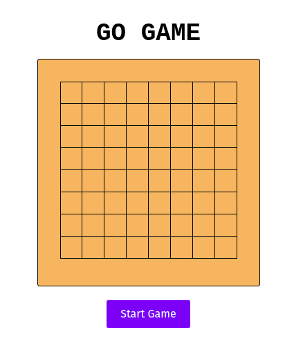
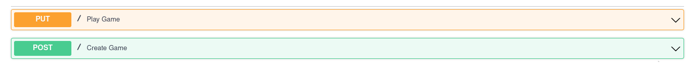
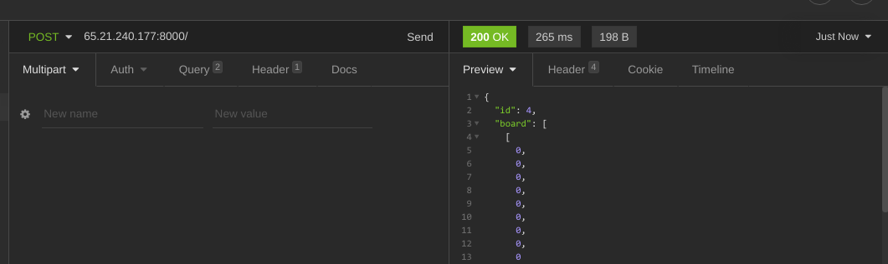
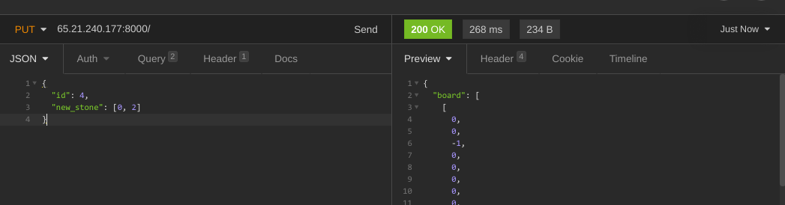

# نحوه بازی
شما سنگ مشکی هستید و کامپیوتر سنگ سفید. باید سعی کنید سنگ کامپیوتر را از چهار جهت بالا پایین چپ و. راست محاصره کنید.

# نکات پیاده سازی
از اونجایی که بازی برای رستوران و اهدای کد هدیه باید طراحی شود نیاز هست که اقدامات بازی سرور ساید انجام, تایید و ثبت شود.
درحال حاضر بازی با تعامل ماتریکس بازی با سرور در جریان قرار میگرد.
برای مرحله پروداکشن که نیاز به ثبت نام بود میتوان با دیتابیس و دخیره مراحل بازی امنیت بازی و جلوگیری از تقلب رو افزایش داد

در حال حاضر کامپیوتر با شبیه سازی وضعیت هر موقعیت تو بازی و بررسی نتایج اون روی سرور تصمیم میگیره که توی کدوم نقطه بازی کنه. نکته اینجاس که کاربر تا زمانی که نتونه از ترفند های به اصطلاح دو راهه کردن استفاده کنه نمیتونه بات رو شکست بده
بات تمام وضعیت ها رو با بررسی همسایگی مهره هایش آزمایش میکنه و از محاصره شدن جلوگی میکنه

# اسکرین شات

