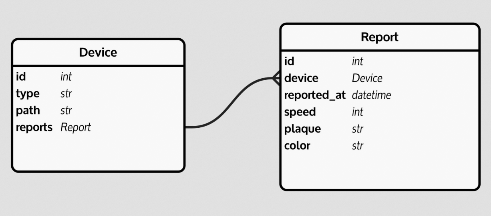
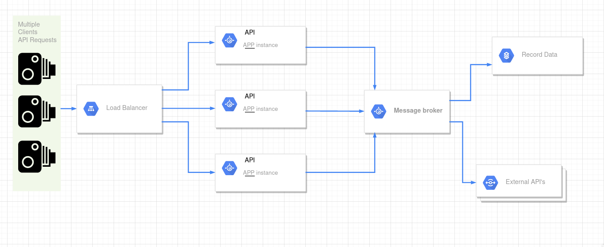

# با ترافیک زیاد چه کنیم؟
خب وقتی حرف از درخواست های بالاس هست, همینطور که این درخواست ها فقط برای ثبت اطلاعات هستند و پاسخ نیاز ندارند, مطمعنا باید از `message broker` ها استفاده کنیم.

اگر نتیجه برای ارسال کننده درخواست مهم نیست, چه بهتر که درخواست رو در یک صف قرار دهیم تا `worker` های
درحال اجرا در پس ضمینه کارشونو انجام بدن! اما از چه تکنولوژی برای ایجاد صف استفاده کنیم؟ خب `rabbitMq`! یا حتی
`redis` ( با استفاده [Pub/Sub](https://redis.io/topics/pubsub))

ما `rabbitMq` استفاده میکنیم.

# بعد از ثبت؟
در پس زمینه تسک های مختلفی تعریف شده, وقتی اطلاعات ذخیره شد مجدد وارد صف دیگری میشه تا تسک های بررسی
روی آن انجام شه. تسک هایی که وب سرویس آنها بهمون ارائه شده
همچنین چون در این تسک ها درخواست هایی به third-party ها ارسال میشه و باید منتظر درخواست ها ماند,
بهتر است از درخواست های `sync` اجتناب و از درخواست های `async` استفاده کنیم.

# زبان و تکنولوژی
پایتون این روزا خیلی پیشرفت کرده. در کنار سادگی کتابخانه و فرم ورک مختلف براشون وجود داره که امتحانشونو پس دادن.
برای وب اینترفیس بهتره که از یک فرم ورک `ASGI` (`async`) استفاده کنیم.
اگر انتخابمون کارکشته ترین و سریع باشه, ‍[Starlette](https://github.com/encode/starlette) و اما اگر انتخابمون یه چیز جدید تر ولی سریع تر باشه, [BlackSheep](https://github.com/Neoteroi/BlackSheep/)
درحال حاضر ترجیح ما روی کارکشته ترینه.

البته استفاده از یک وب سرور هم لازمه. بهتره که درخواست ها رو اول وب سرور هندل کنه, بین `apache`, `nginx` و `traefik` ما از `traefik` استفاده میکنیم که درون خود یک load balancer نیز دارد.

برای استفاده از `message broker` ها هم از میتونیم از کتابخانه `pika` استفاده کنیم توی low-level ترین حالت! اما ترجیح ما اینجا `celery` خواهد بود. چون داکیومنت خوبی داره, کامیونیتی, تیم دولوپ بزرگ, سادگی در استفاده و خوانایی خیلی خوبی هم داره.

# معماری پیشنهادی
حرف از `message broker` هاست! سرویس های مختلفی که با هم کار میکنند, میکروسرویس ها (`microservice architecture`)

# دواوپس
توی مرحله پروداکشن برای بیلد کردن میکروسرویس ها از `docker` و `docker-compose` استفاده میکنیم

# دیتابیس‌های پیشنهادی

با توجه ساختار داده‌های ما دیتابیس مورد نیاز از نوع relational یا به اصطلاح sql می‌باشد که داده‌های ما نیز ساختارمند هستند.

همچنین این نوع دیتابیس‌ها با سیستم‌های transaction-oriented که ساختار سیستم‌ما نیز هست، سازگاری بیشتری دارند.

از انواع دیتابیس‌های sql موجود، postgresql را انتخاب میکنیم.

از دلایل انتخاب این دیتابیس به رایگان و متن‌باز بودن، قابلیت گسترش بالا، دارا بودن data integrity جهت اطمینان از صحت دیتای وارد شده،
ثابت شده بودن از لحاظ کمیت و کیفیت ذخیره دیتا و هم‌زمانی در پاسخگویی به درخواست‌ها، پرفورمنس بالا به دلیل استفاده از indexing و روش‌های پیشرفته آن، امکانات مناسب برای database replication و امنیت می‌توان نام برد.

# دیاگرام

