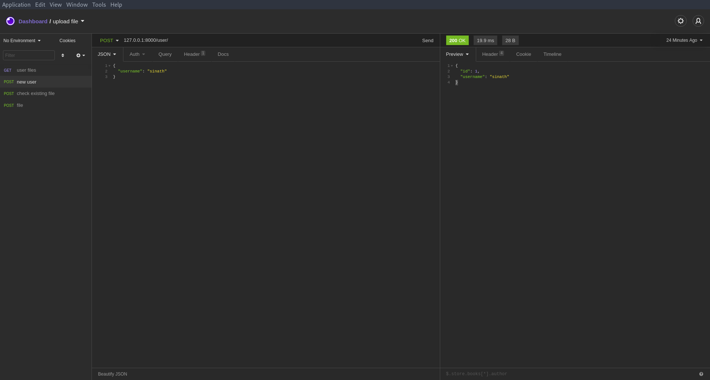
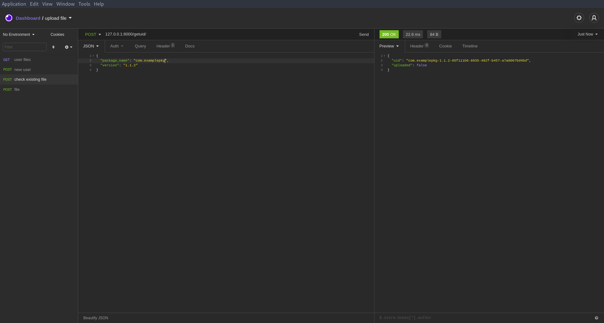
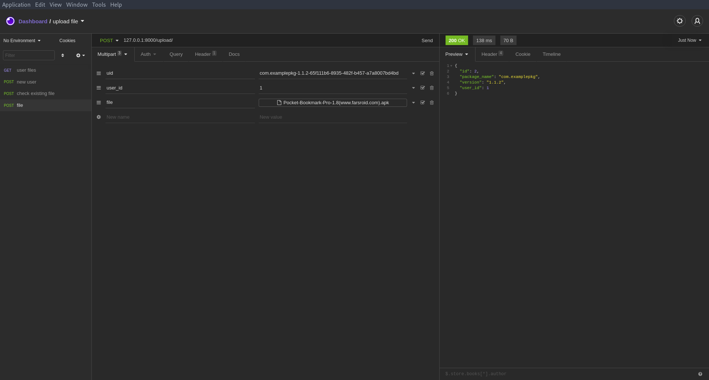
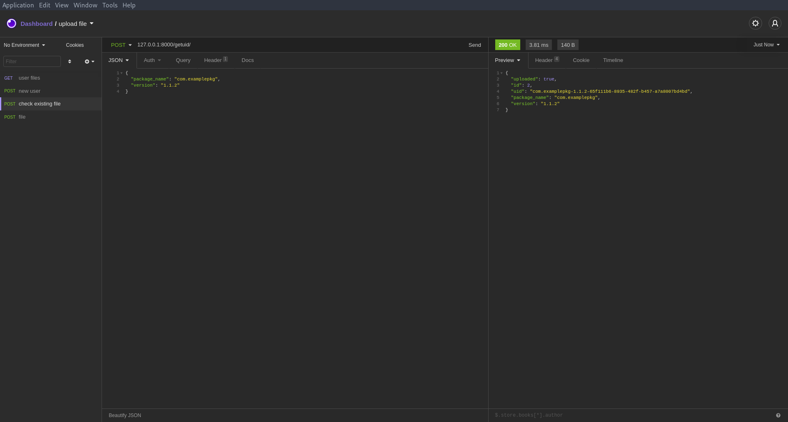
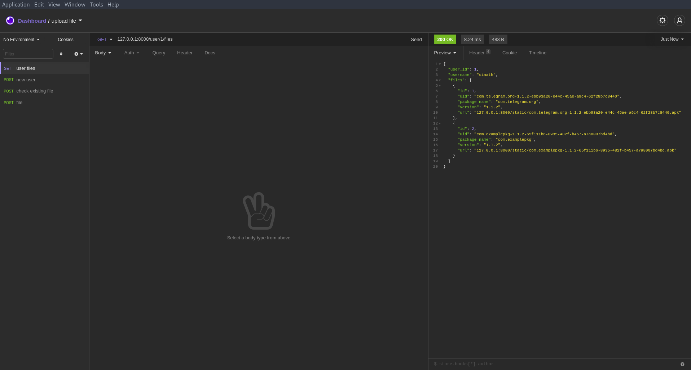

## سوال ‍۶ - پشتیبان گیری

### صورت مسئله
آپلود فایل‌های حجیم با تعداد زیاد و بهینه بودن اپلود و فضای دیسک و سرعت عملیات

### راه حل

یکی از بهینه سازی‌ها ذخیره نکردن فایل‌های تکراری میباشد
اگر یک فایل با package_name و version مشابه قبلا آپلود شده باشد، از آپلود مجدد خودداری کرده و در دیتابیس همان فایل قبلی به یوزر لینک می‌شود.

#### اندپوینت‌های وب سرویس

get: `/user/{user_id}/files/` فایل‌های اپلود شده یک کاربر

‍post: `/user/` ساخت کاربر جدید

post: `/getuid/` ارسال درخواست آپلود فایل

post: `/upload/` آپلود فایل

برای آپلود فایل ابتدا نیاز است درخواست ارسال فایل ارسال شود و بعد از تایید
فرایند اپلود صورت گیرد.

نمونه اجرای وب سرویس به صورت تصویری:

uid دریافت شده هنگام درخواست باید هنگام
آپلود فایل ارسال شود
اگر فایل از قبل آپلود نشده باشد، نیاز است که فایل نیز به همراه آن ارسال شود.

### اجرا

`uvicorn main:app`